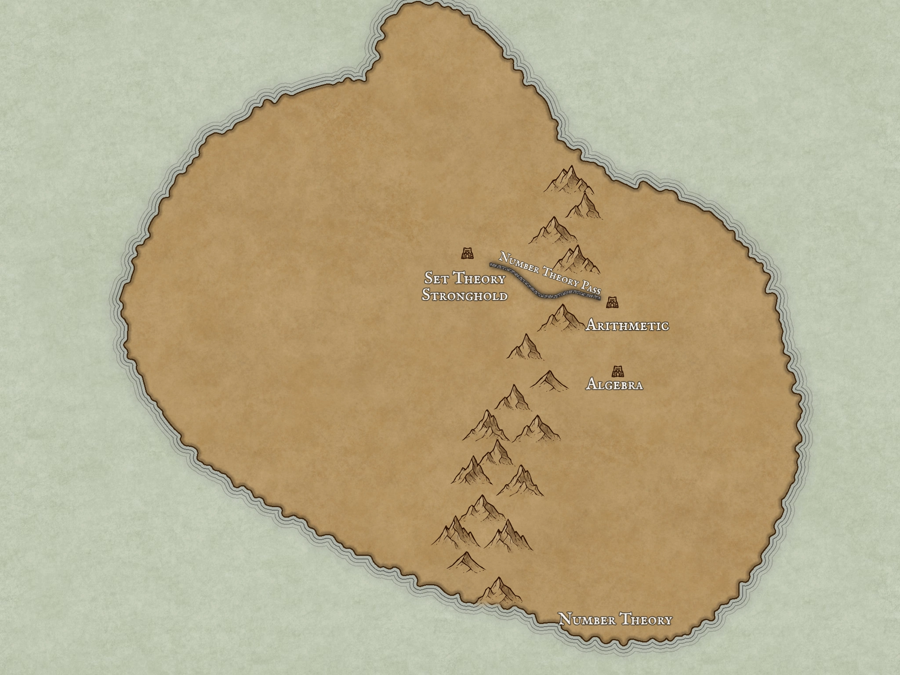

    
    <svg viewBox="0 0 2048 1536" fill="none" xmlns="http://www.w3.org/2000/svg" style="position: absolute; top: 0; right: 0; bottom: 0; left: 0">
        <rect opacity="0" x="808" y="653" width="164" height="120" fill="#D9D9D9" href="./topics/set_theory.html"/>
        <rect opacity="0" x="1162" y="600" width="151" height="116" fill="#D9D9D9"/>
    </svg>

v3 | It's Wargotime ▢