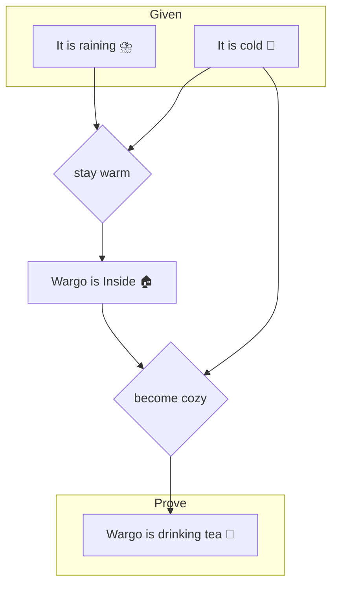

The people passing through the camp of propositional logic regard everything as either
* Propositions
* Connectives

A proposition is a statement that is strictly true or false, and a connective is a relationship between two propositions. This forms the basis for virtually all other fields of logic, and most people staying at this camp pretty quickly hike to [First Order Logic](./topics/logic_first_order.html).

# An Example
Logic in general seeks to state what is known as precisely as possible and then use that knowledge to determine what all can possibly be known. Even with the primitive tools of propositional logic, we can start to see how that works by considering my behavior on a rainy day :

$$
R \equiv \text{It is raining outside} \\
C \equiv \text{It is cold outside} \\
I \equiv \text{Wargo is inside} \\
T \equiv \text{Wargo is drinking tea} \\
$$

$$
\text{stayWarm} \equiv R \wedge C \rightarrow I \\
\text{becomeCozy} \equiv C \wedge I \rightarrow T \\
$$

> Staying warm is means that when it is raining and it is cold then Wargo is inside \
> Becoming cozy is means that when it is cold outside and Wargo is inside then Wargo is drinking tea

Simply by stating facts and their connectives, we can already discover the hidden truth that every time it rains while it's cold out, I drink tea :

## Notation

Usually, propositions are bound to single-letter variables, and connectives are denoted by the following symbols:

| Symbol | Connective | Meaning |
| ------ | ---------- | ------- |
| $A \wedge B$ | And | Both $A$ and $B$ are true |
| $A \vee B \\ A \parallel B$ | Or | Either $A$ or $B$ is true, maybe both |
| $A \veebar B \\ A \oplus B$ | Xor | Either $A$ or $B$ is true, but not both |
| $\neg A$ | Not | Not $A$ (or $A$ is not true) |
| $A \rightarrow B$ | Implies | When $A$ then $B$ |
| $A \equiv B \\ A \leftrightarrow B$ | Equals | $A$ equals $B$
