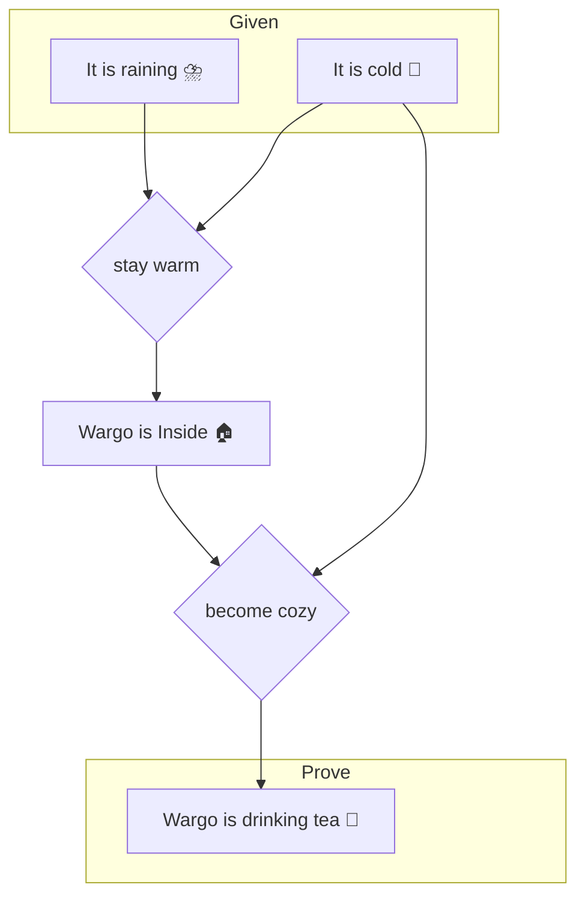

The people passing through the village of propositional logic regard everything as either
* Propositions
* Connectives

A proposition is a statement that is strictly true or false, and a connective is a relationship between two propositions. This forms the basis for virtually all other fields of logic, and most people staying in this village pretty quickly hike to [First Order Logic](./topics/logic_first_order.html).

# An Example
Logic in general seeks to state what is known as precisely as possible and then use that knowledge to determine what all can possibly be known. Even with the primitive tools of propositional logic, we can start to see how that works by considering my behavior on a rainy day :

$$
R \equiv \text{It is raining outside} \\
C \equiv \text{It is cold outside} \\
I \equiv \text{Wargo is inside} \\
T \equiv \text{Wargo is drinking tea} \\
$$

$$
\text{stay warm} \equiv R \wedge C \rightarrow I \\
\text{become cozy} \equiv C \wedge I \rightarrow T \\
$$

> Staying warm means that when it is raining and it is cold then Wargo is inside \
> Becoming cozy means that when it is cold outside and Wargo is inside then Wargo is drinking tea

By breaking down the world into simple facts and their connectives, we can already discover the hidden truth that every time it rains while it's cold out, I drink tea :

## Notation

Usually, propositions are bound to single-letter variables, and connectives are denoted by the following symbols:

| Symbol | Connective | Meaning |
| ------ | ---------- | ------- |
| $A \wedge B$ | And | Both $A$ and $B$ are true |
| $A \vee B \\\\ A \parallel B$ | Or | Either $A$ or $B$ is true, maybe both |
| $A \veebar B \\\\ A \oplus B$ | Xor | Either $A$ or $B$ is true, but not both |
| $\neg A$ | Not | Not $A$ (or $A$ is not true) |
| $A \rightarrow B$ | Implies | When $A$ then $B$ |
| $A \equiv B$ | Definition | $A$ is defined as $B$ |
| $A \leftrightarrow B$ | Equals* | $A$ equals $B$ |

*Technically, this is an "If and only If" (IFF) statement, which is botht a bidirectional implication, as well as a form of equality.

---

<em>In <a href="/appendix/mathlib.html">Mathblib</a>...</em>

As stated earlier, Propositions form the basis of logic, so it's no surprise that [Prop is one of the few things that is foundationally defined in the language itself](https://leanprover-community.github.io/mathlib4_docs/foundational_types.html). Being foundational means that if it wasn't defined for us, we wouldn't be able to implement it ourselves.

Given that Propositions represent what is true, omitting them would amount to not having the idea of what it means to be true. Deriving that concept frorm a vacuum feels borderline philosophical.

Also interesting is that the [implication connective is just a function, which is also foundationally defined in the language](https://leanprover-community.github.io/mathlib4_docs/foundational_types.html). Given that implications represent causality, this also feels like an appropriate foundation, or else the philsosphical debate of causality would probably be settled.

That being said, the rest of the propositional connectives are defined as inductive types - [And](https://leanprover-community.github.io/mathlib4_docs/Init/Prelude.html#And), [Or](https://leanprover-community.github.io/mathlib4_docs/Init/Prelude.html#Or), [Xor](https://leanprover-community.github.io/mathlib4_docs/Mathlib/Logic/Basic.html#Xor), [Not](https://leanprover-community.github.io/mathlib4_docs/Init/Prelude.html#Not), [Eqals](https://leanprover-community.github.io/mathlib4_docs/Init/Prelude.html#Eq). This is fascinating, because in many languages, these operations cannot be implemented by the user. Even languages that let you define your own operations (like C++) also have to bundle their own, because custom operators defer to the language builtin ones at some point. But in dependently typed languages like Lean, there is a more foundational logic that these can be derived from.

